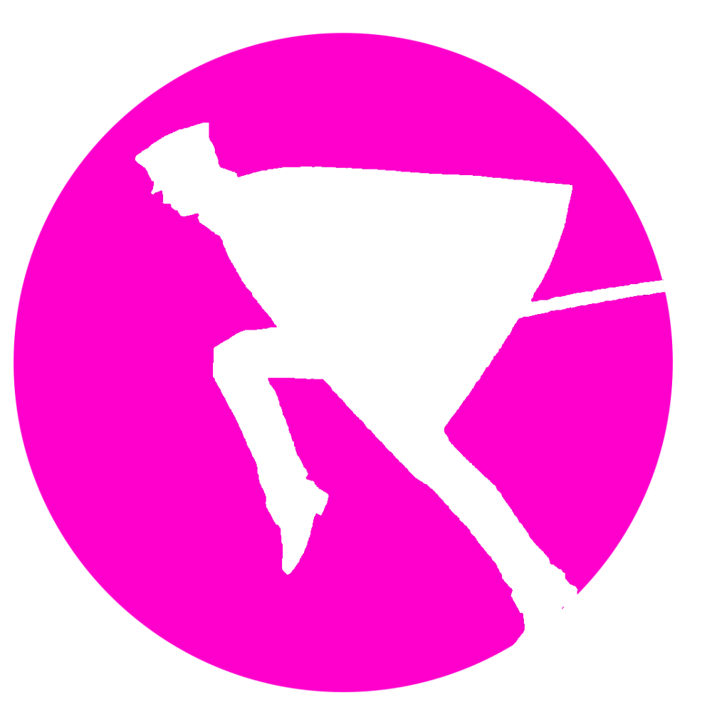

<h1 align="center">WELCOME</h1>

  

<h3 align="center"> I hope you're not bored </h3>
 

###

<h4 align="left">My name is Adriel. I'm an engine developer/gameplay programmer/designer/artist

###

<h2 align="left">About ME</h2>

###

🇮🇩 🏳️‍🌈 Writing programs since I was 14 Passionate about everything tech & art  Things I wanna do: >Make video games >Make art >Program GPUs >Summon demons

###

<h2 align="left">Things I Am Capable Of Working With At A Higher Than Average Performance</h2>

###

  
  
  
  
  
  
  
  
  
  
  
  
  
  
  

###

  
  
  
  
  
  
  
  
  

###
